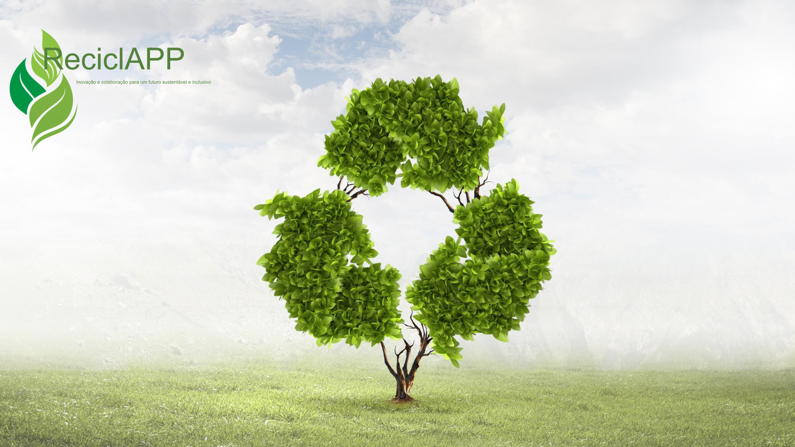
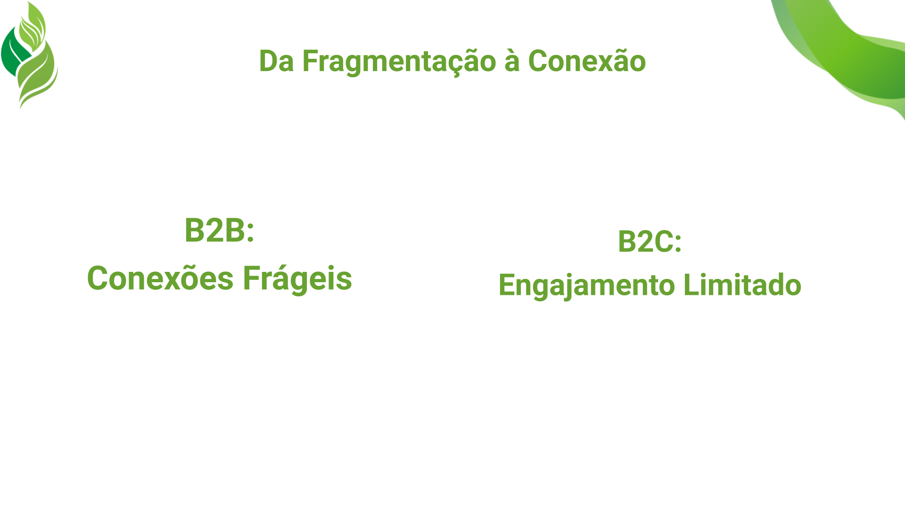
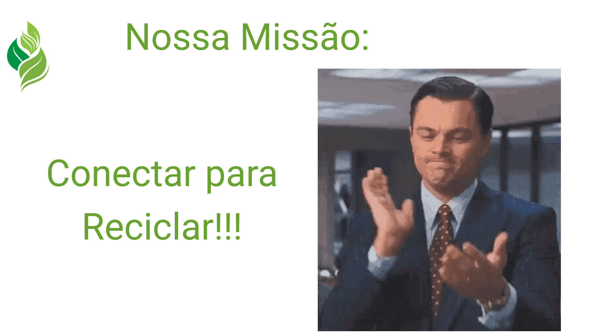
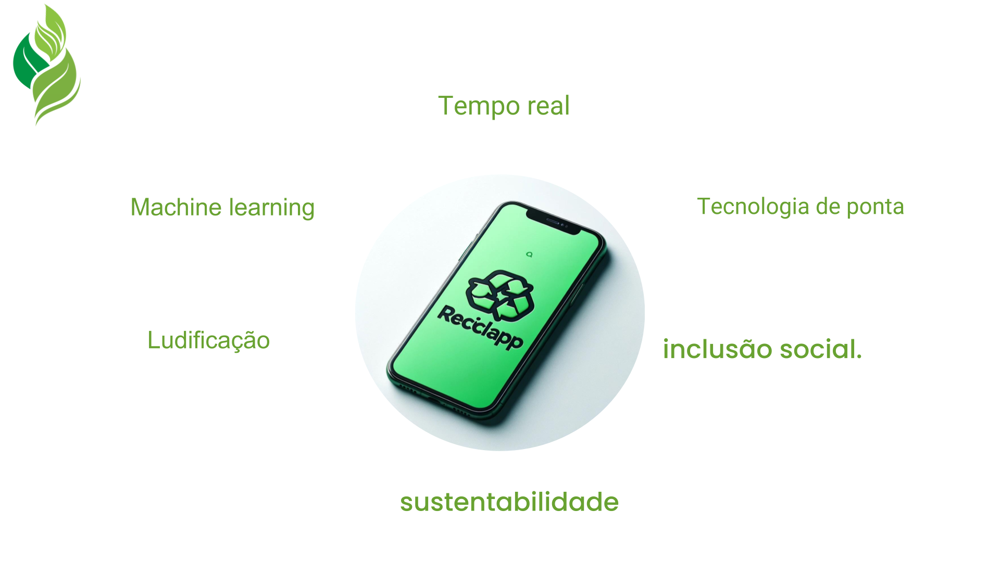
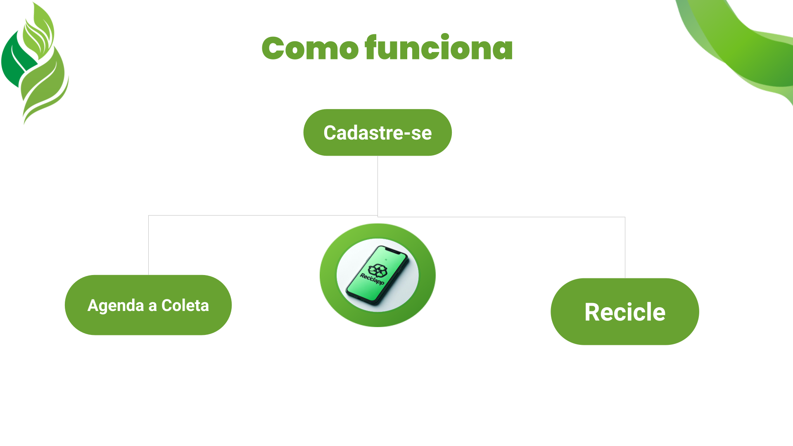
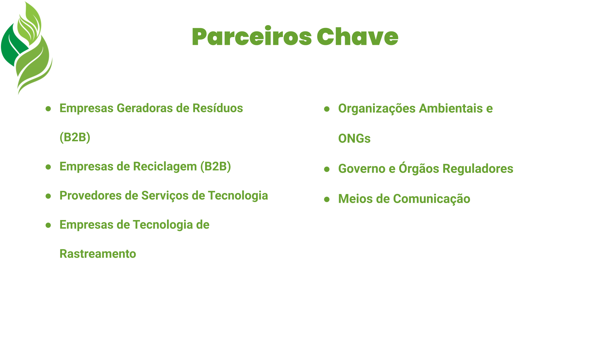
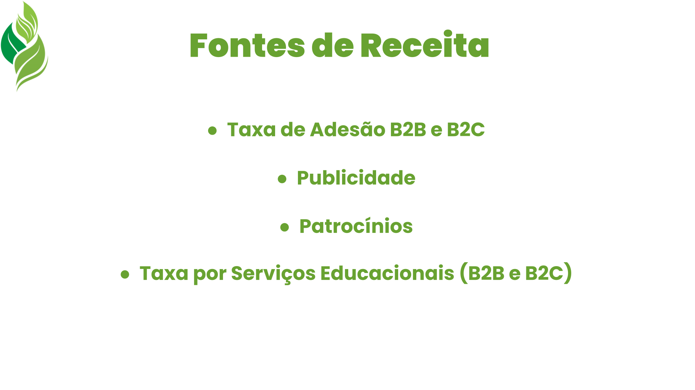
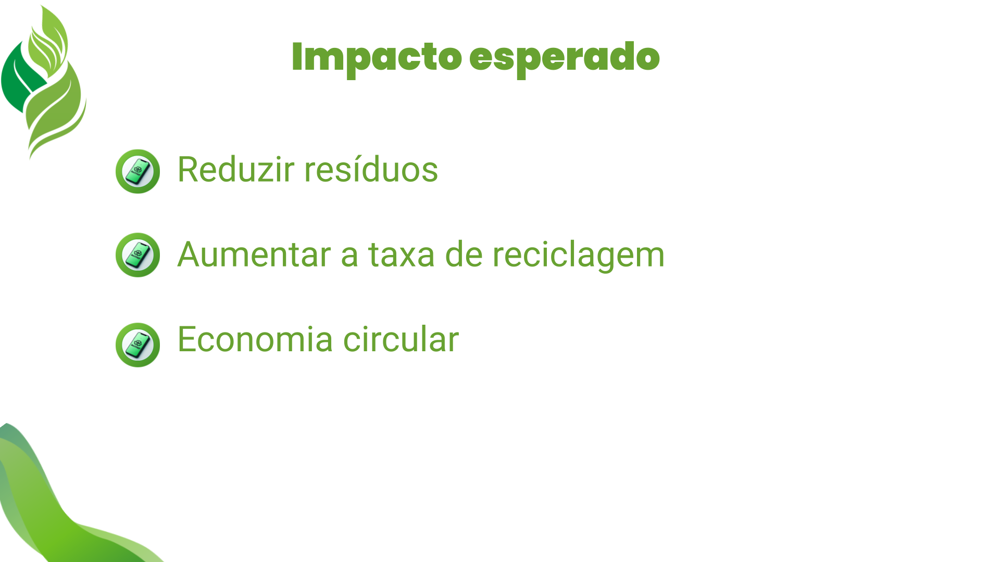
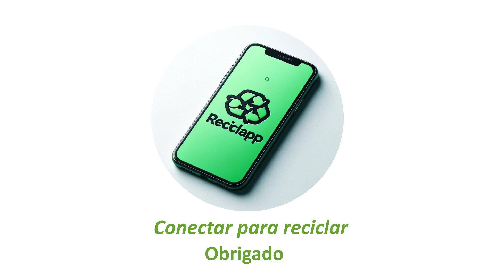

# ReciclaApp - Climathon São Paulo

## Nossa Solução no Climathon São Paulo

Este é o nosso projeto apresentado durante o evento do Climathon de São Paulo, onde mais de 19 equipes se reuniram com ideias inovadoras. O Climathon foi um evento organizado pela Prefeitura de São Paulo em colaboração com diversos departamentos de sustentabilidade.

--------------------------------------------------------------
A proposta deste projeto é estabelecer uma conexão por meio de um aplicativo entre médias e pequenas empresas de reciclagem, abrangendo tanto o mercado business-to-business (B2B) quanto o business-to-consumer (B2C). Essa integração é realizada através de um algoritmo inteligente baseado em aprendizado de máquina, visando promover a sustentabilidade e otimizar as operações de reciclagem.

## Imagens do Projeto

Aqui estão algumas imagens do nosso projeto:

  

  

  

  

  

  

  

  

  

## Sobre o Projeto

Este projeto foi idealizado em apenas 3 dias por Vanessa Borges e Guillermo Camahuali.

) vanessa

) Guillermo
